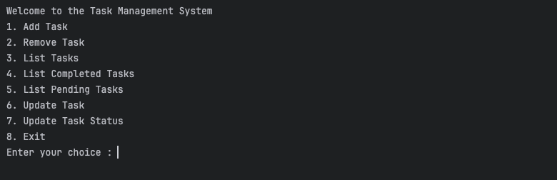
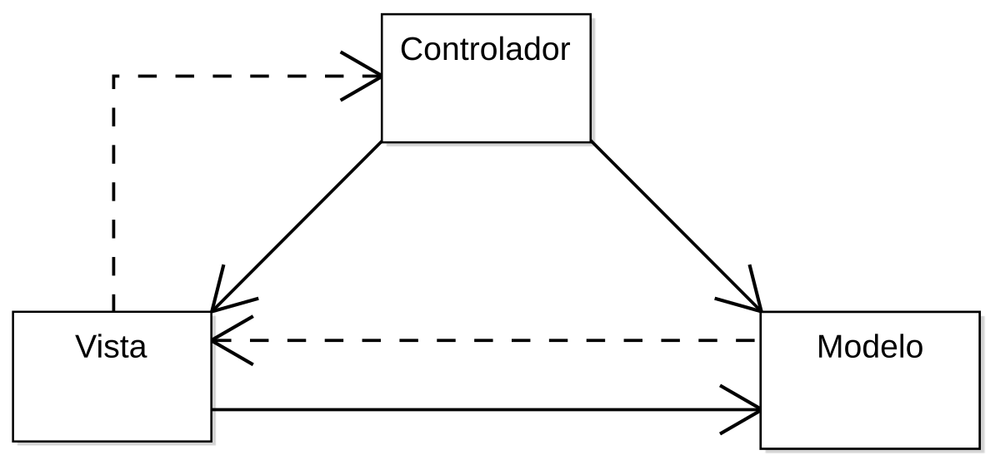

# Java Devtalles Fudamentals MVC 🔥
Este repositorio forma parte del curso: [Java: Explore el lenguaje desde cero](https://www.udemy.com/course/devtalles-java/?couponCode=MT220725G1).
En este curso se realizó una aplicación de consola para el manejo de tareas:

---
## Temas vistos  📚
1. ¿Qué es el **patrón de arquitectura MVC**?
2. ¿Cómo **organizar archivos** en Java usando el patrón MVC?
3. Utilización de la librería **Gson** para la **persistencia de datos** en archivos JSON.
4. Control de excepciones eficiente usando _Checked_ y _Unchecked Exceptions_. 🔻
---

## Descripción breve del patrón de arquitectura MVC 📖
MVC proviene de las siglas **Model - View - Controller**, el cual consiste en un patrón de
arquitectura que nos ayuda a separar nuestro código en distintos componentes para lograr cumplir
el principio SRP (_Single Responsability Principle_ o Principio de Responsabilidad Única).

## Beneficios del patrón de arquitectura MVC ☝
- Código más legible y organizado.
- Permite que tu código pueda ser trabajado por varios colaboradores facilmente.
- Código **escalable**.

## ¿Qué hace cada componente que forma parte del patrón de arquitectura MVC? 📝

1. **Modelo**: Se encarga de comunicarse con la base de datos. Todo lo que esté relacionado con regalas de negocio
y el accesso a la persistencia de datos, se trabaja en esta capa.
2. **Vista**: Se encarga de renderizar vistas de tu aplicación, como por ejemplo: Una página HTML.
3. **Controlador**: Esta capa controla la interacción entre la vista y el modelo. Maneja la lógica de la 
aplicación y válida los datos ingresados al sistema.

